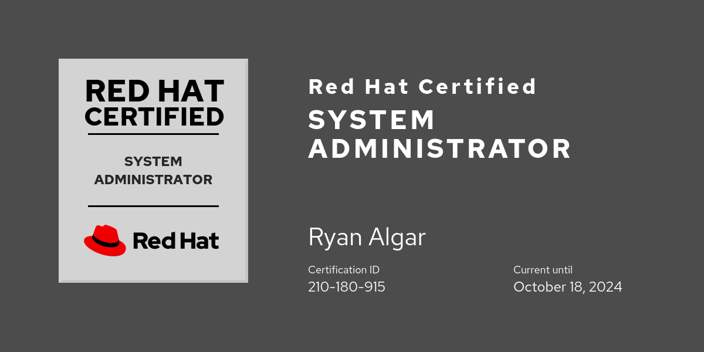

<!-- My Github Profile -->
## Contact Info

## About Me

**Currently looking for work.**

Technology enthusiast. Continuous learner. Interested in automation, security, reliability, and scalability.

### Comfortable with:

### Currently learning:

## Certifications

